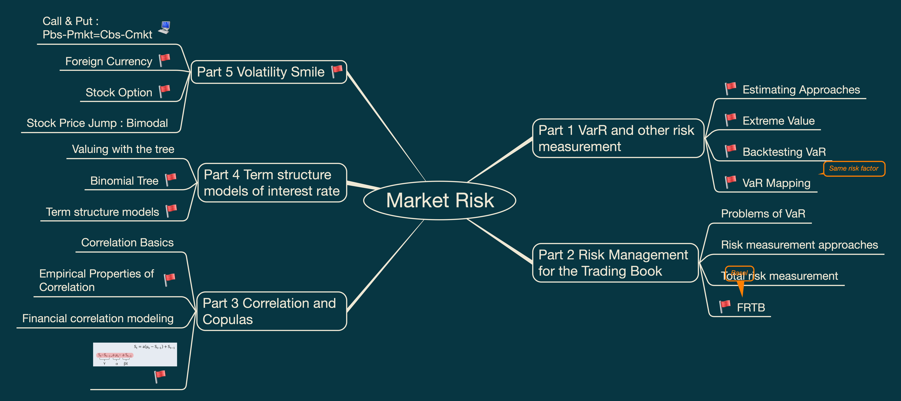
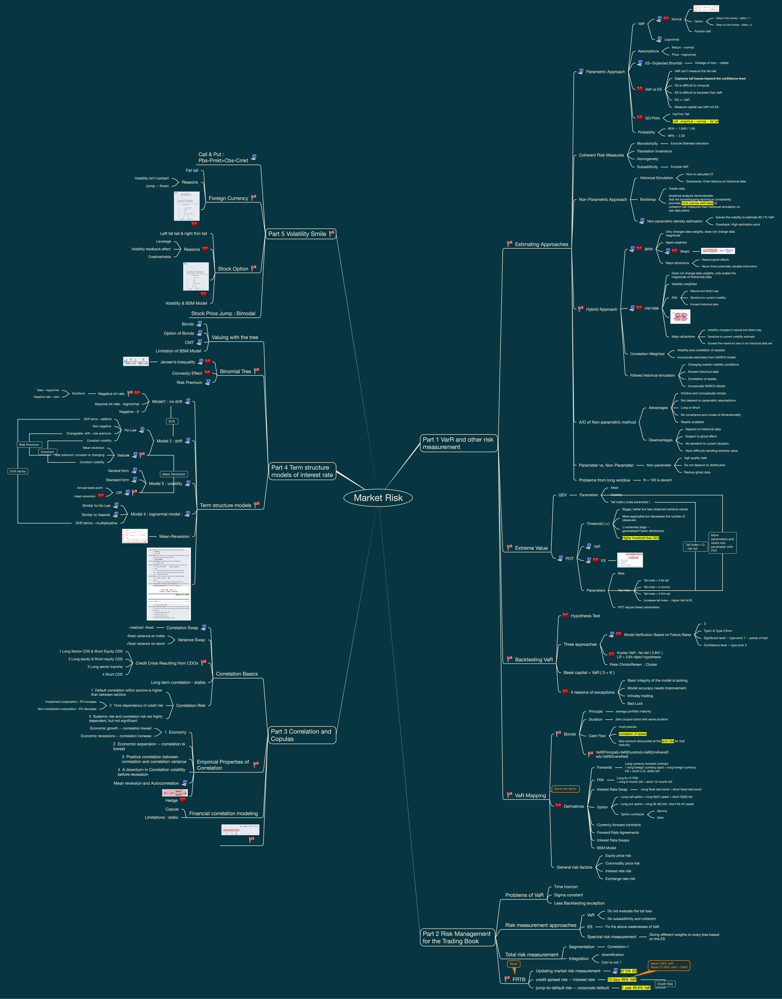

# Market Risk

This folder contains my FRM Level II Market Risk study materials, including visual mindmaps and structured revision notes.

These materials are designed for personal review, exam preparation, and long-term knowledge organization.

## Contents

- VaR and other risk measurement
- Risk Management for the Trading Book
- Correlation and Copulas
- Term Structure Models of Interest Rates
- Volatility Smile

## Mindmap Preview

## Full Mindmap

## PDF Version

[View Market Risk Mindmap PDF](market-risk-mindmap.pdf)

## Notes

Structured written notes will be added gradually as this repository develops.
