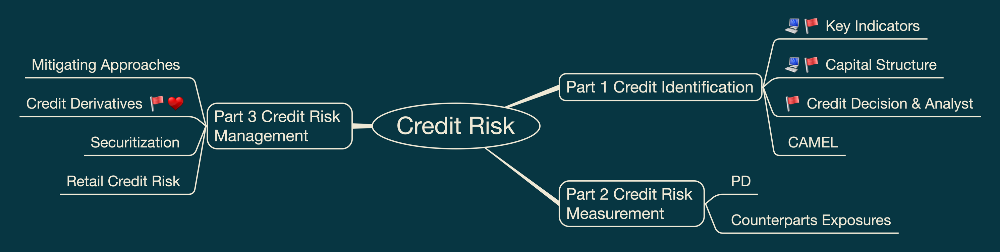
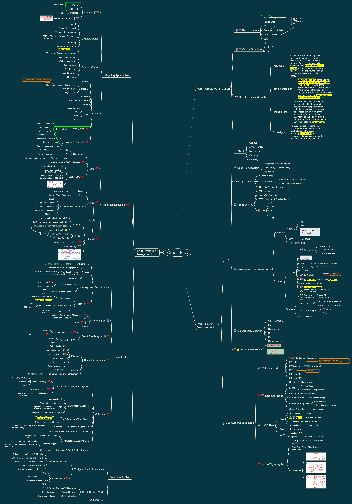

# Credit Risk

This folder contains my FRM Level II Credit Risk study materials, including visual mindmaps and structured revision notes.

These materials are designed for personal review, exam preparation, and long-term knowledge organization.

## Contents

- Credit Risk Identification
- Credit Decision and Credit Analysis
- Rating Systems and Rating Agencies
- Credit Risk Measurement
- Structural Models and Merton Model
- KMV and Distance to Default
- Hazard Rates and Default Probabilities
- Exposure Metrics and Counterparty Credit Risk
- CVA, DVA, BCVA and XVA
- Credit Derivatives, CDS, Basket CDS, TRS and CLN
- Securitization, MBS, CDO, CLO and Covered Bonds
- Credit Risk Mitigation, Collateralization, Netting and CCP
- Retail Credit Risk and Mortgage Credit Assessment

## Mindmap Preview

## Full Mindmap

## PDF Version

[View Credit Risk Mindmap PDF](credit-risk-mindmap.pdf)

## Notes

Structured written notes will be added gradually as this repository develops.
