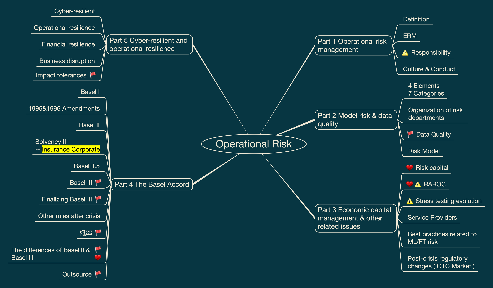

# Operational Risk

This folder contains my FRM Level II Operational Risk study materials, including visual mindmaps and structured revision notes.

These materials are designed for personal review, exam preparation, and long-term knowledge organization.

## Contents

- Basel Accord
- Operational Risk Framework
- Model Risk
- Data Quality
- Economic Capital
- RAROC
- Stress Testing
- Risk Capital
- Service Providers
- Cyber Risk and Technology Risk

## Mindmap Preview

## PDF Version

[View Operational Risk Mindmap PDF](Operational_Risk_Mindmap.pdf)

## Notes

Structured written notes will be added gradually as this repository develops.
