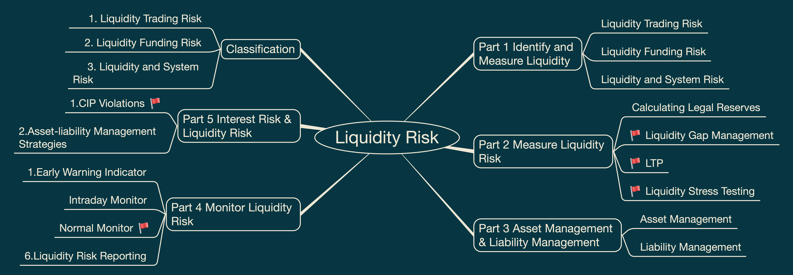
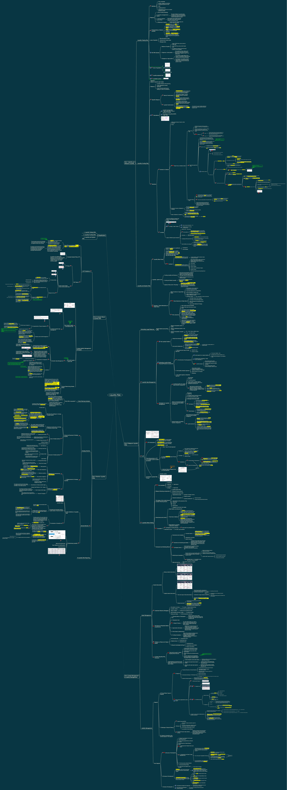

# Liquidity Risk

This folder contains my FRM Level II Liquidity Risk study materials, including visual mindmaps and structured revision notes.

These materials are designed for personal review, exam preparation, and long-term knowledge organization.

## Contents

- Identify and Measure Liquidity
- Measure Liquidity Risk
- Asset Management and Liability Management
- Monitor Liquidity Risk
- Interest Rate Risk and Liquidity Risk

## Mindmap Preview

## Full Mindmap

## PDF Version

[View Liquidity Risk Mindmap PDF](liquidity-risk-mindmap.pdf)

## Notes

Structured written notes will be added gradually as this repository develops.
