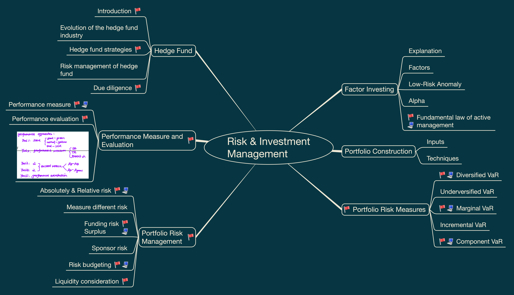
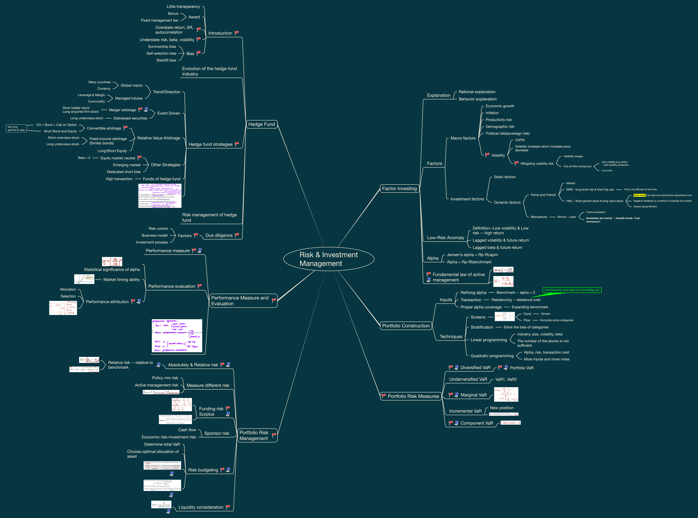

# Risk Management and Investment Management

This folder contains my FRM Level II Risk Management and Investment Management study materials, including visual mindmaps and structured revision notes.

These materials are designed for personal review, exam preparation, and long-term knowledge organization.

## Contents

- Factor Investing
- Portfolio Construction
- Portfolio Risk Measures
- Portfolio Risk Management
- Performance Measurement and Evaluation
- Hedge Funds
- No-trade Region

## Mindmap Preview

## Full Mindmap

## PDF Version

[View Risk Management and Investment Management Mindmap PDF](risk_invest_mgt_mindmap.pdf)

## Notes

Structured written notes will be added gradually as this repository develops.
